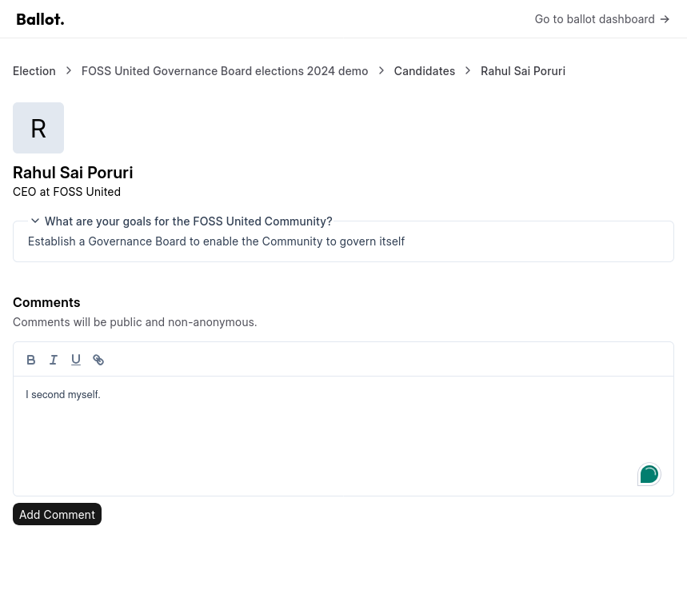
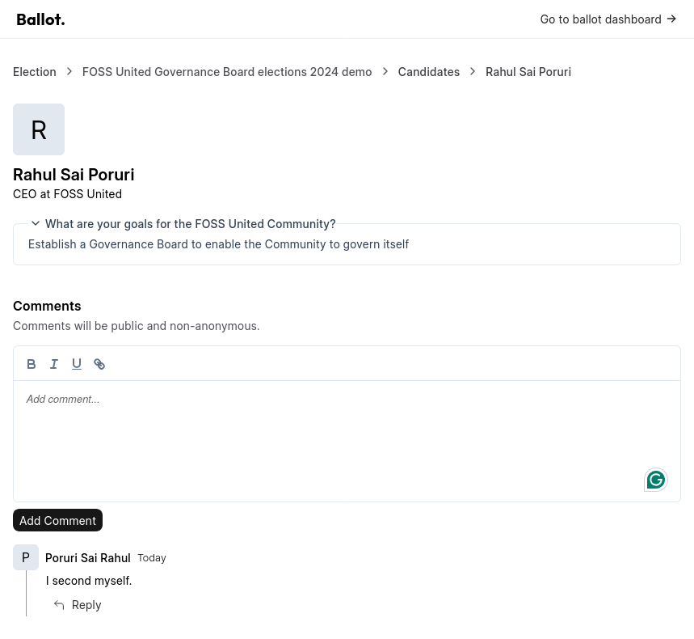

# Standing for election

* As a member of the Community, "All Elections" is where you will find 
  inforamtion about active Elections within the Community

## Submit your Candidature form

* You can select one of the listed Elections to look at additional information
  about it and to submit your Candidature form

* Please provide all requested information and click on the "Submit" button

* Your Candidature form submissions are visible under the "My Submissions" page

## Seeking nominations from the Community

* The list of Candidates who have successfully submitted a Candidature form
  for an Election can be found on the Election page

* Members of the Community can voluntarily or by request comment on a Candidate
  and nominate them. Nominations from esteemed and/or active members of the
  Community lend credibility to the Candidate, especially for members of the
  Community who might not be regularly active or if they are unaware of the
  Candidate

* Nominations submitted by the members of the Community are displayed in the
  same page
