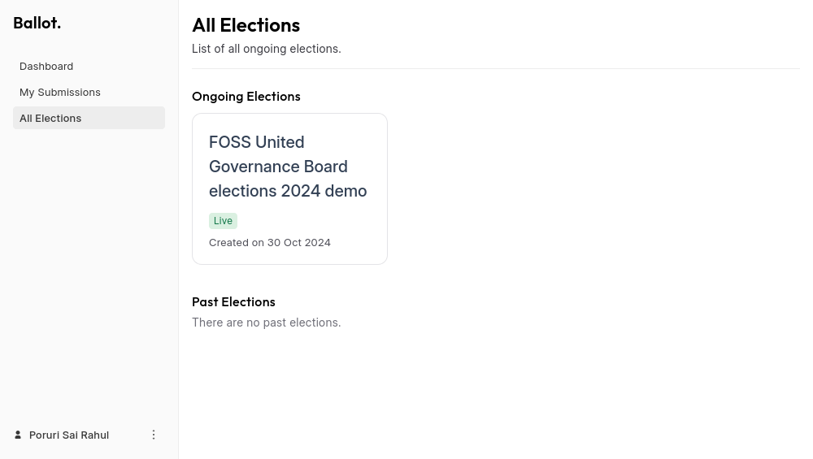
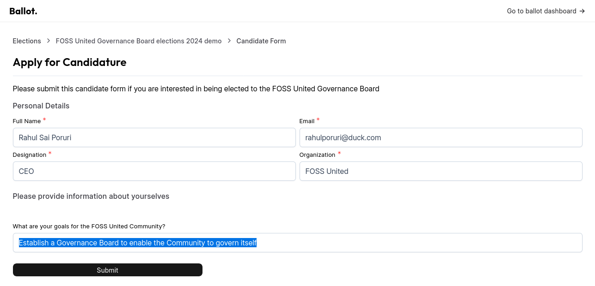
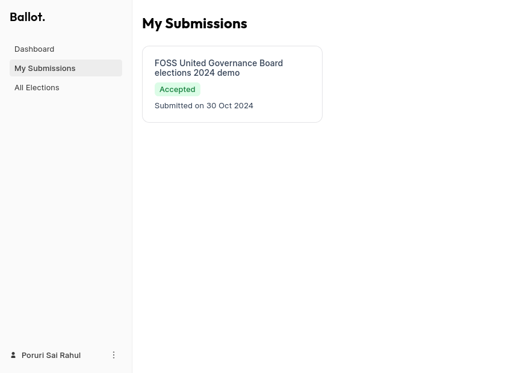

# Standing for election

* As a member of the Community, "All Elections" is where you will find 
  inforamtion about active Elections within the Community

* You can select one of the listed Elections to look at additional information
  about it and to submit your Candidature form

* Please provide all requested information and click on the "Submit" button

* Your Candidature form submissions are visible under the "My Submissions" page

