# Organizing an election

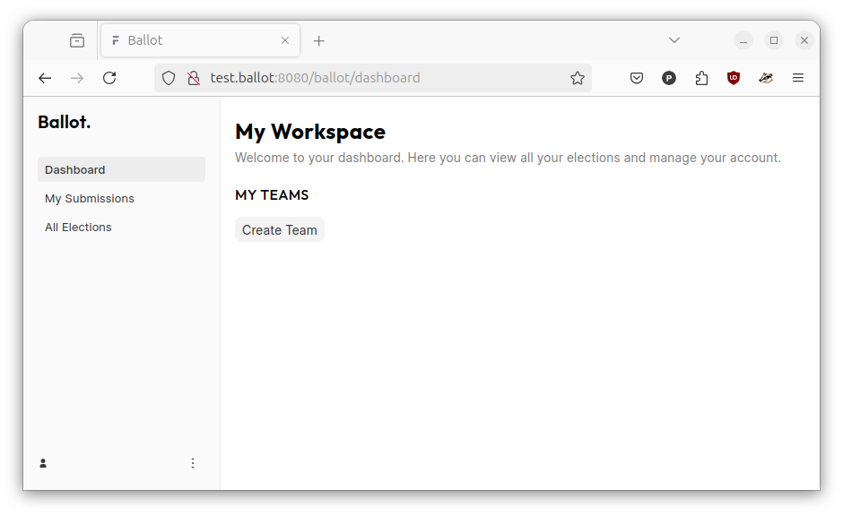

The landing page for Ballot provides easy access to

* the Dashboard, which provides access to the Teams
* the Submissions page, which contains information about my Candidature
  submissions
* the All Elections page, which displays information about all of the "Live"
  Elections

## Creating a team

* Before you organize an Election, you first need to create a Team. You can
  create a Team by clicking on the "Create Team" button on the Dashboard page
  and providing a name.

|Create a Team|Updated Dashboard|
|---|---|
|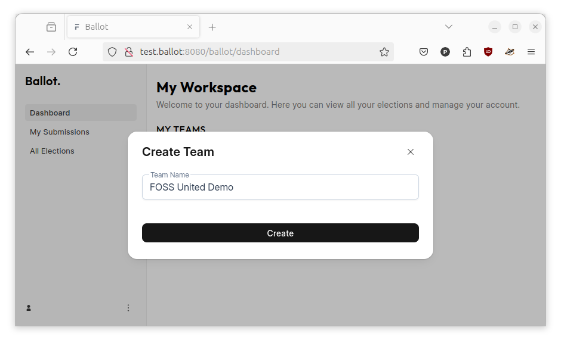|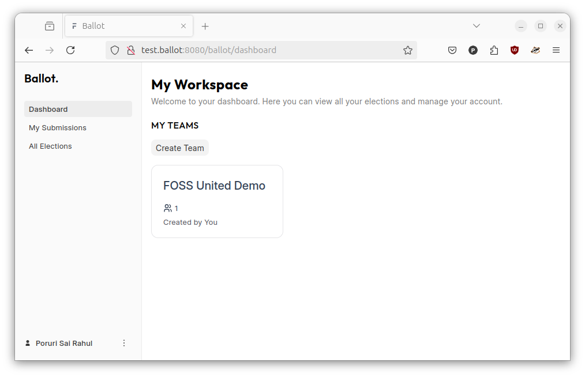|

* Once a Team is created, Members can be added to the team by clicking on the
  "Add Member" button and providing an email address of a User registered on
  the Platform

|Team details|Add a Team member|Updated team details|
|---|---|---|
|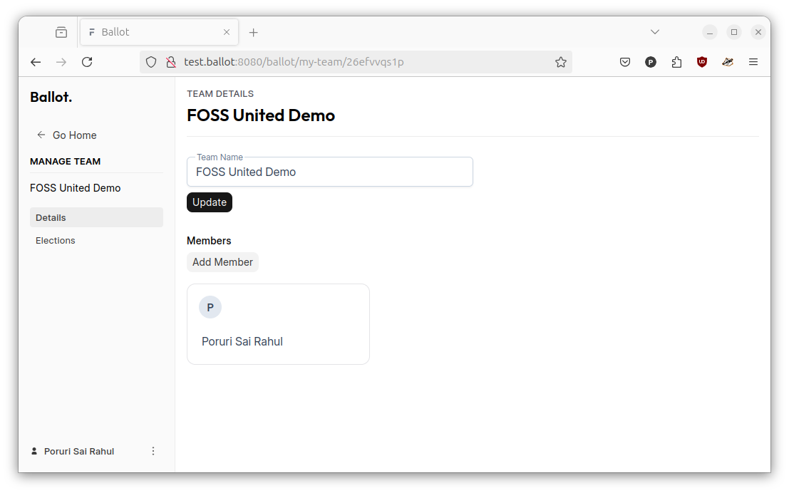|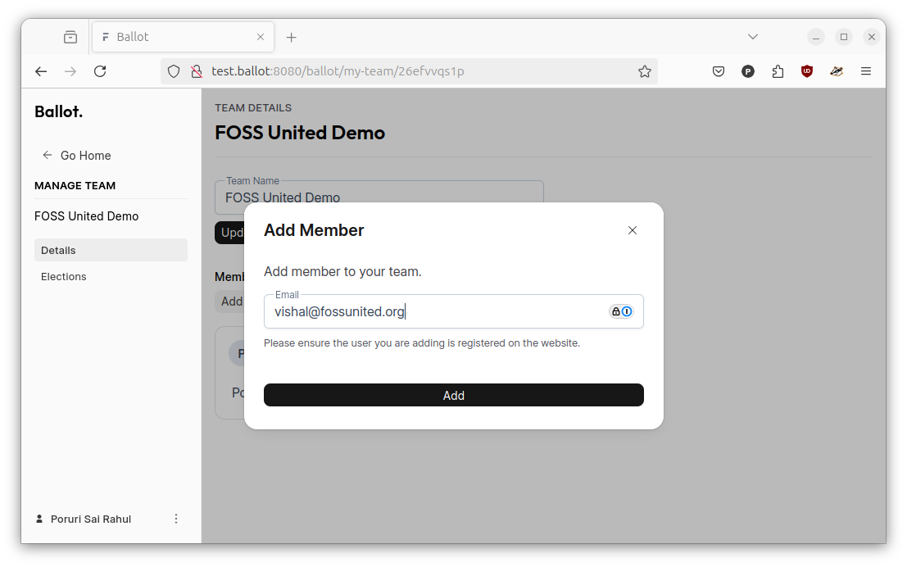|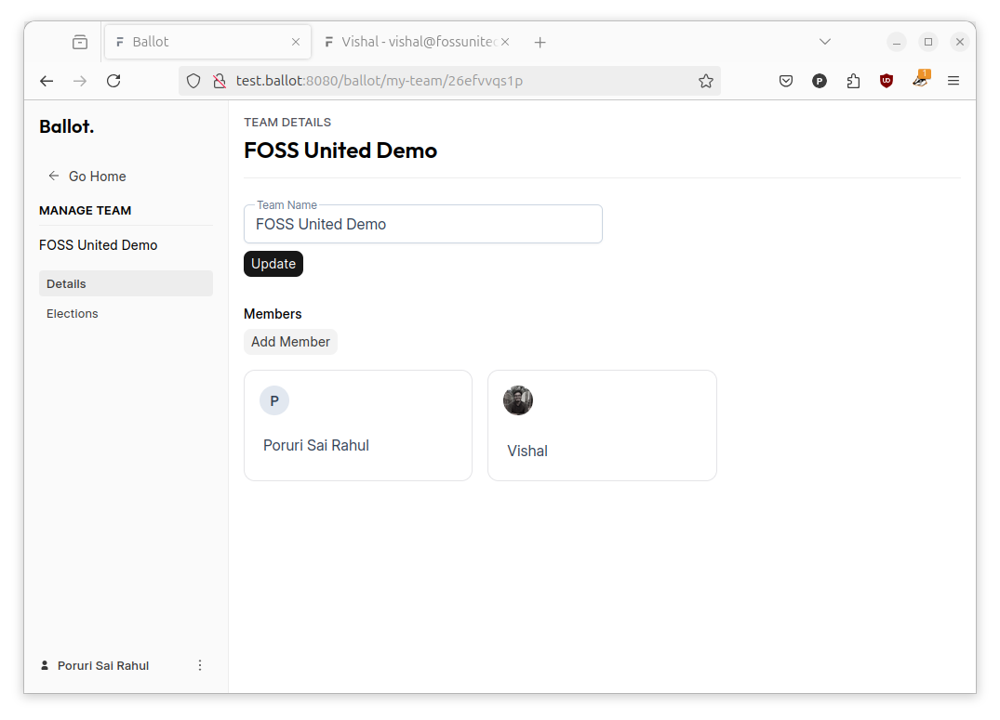|

## Creating an Election

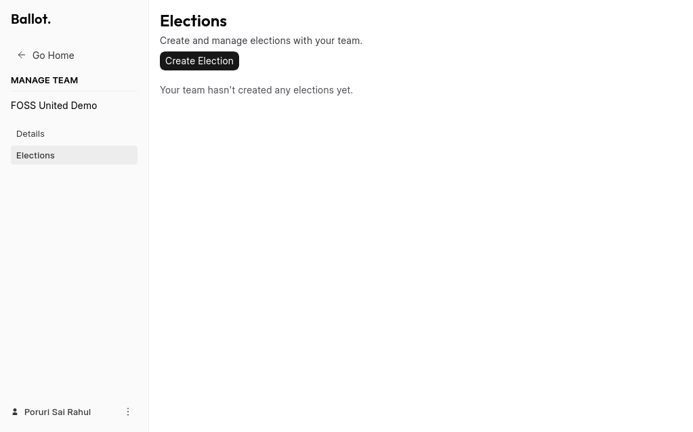

* Once a "Team" has been created, all Elections for the Team can be viewed under
  the "Elections" page. A new Election can be created by clicking on the 
  "Create Election" button and providing a Title for the election.

|Create new Election|Updated Elections page|
|---|---|
|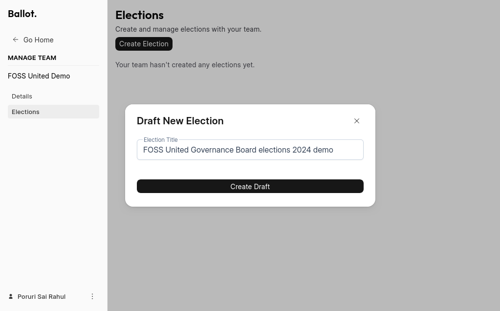|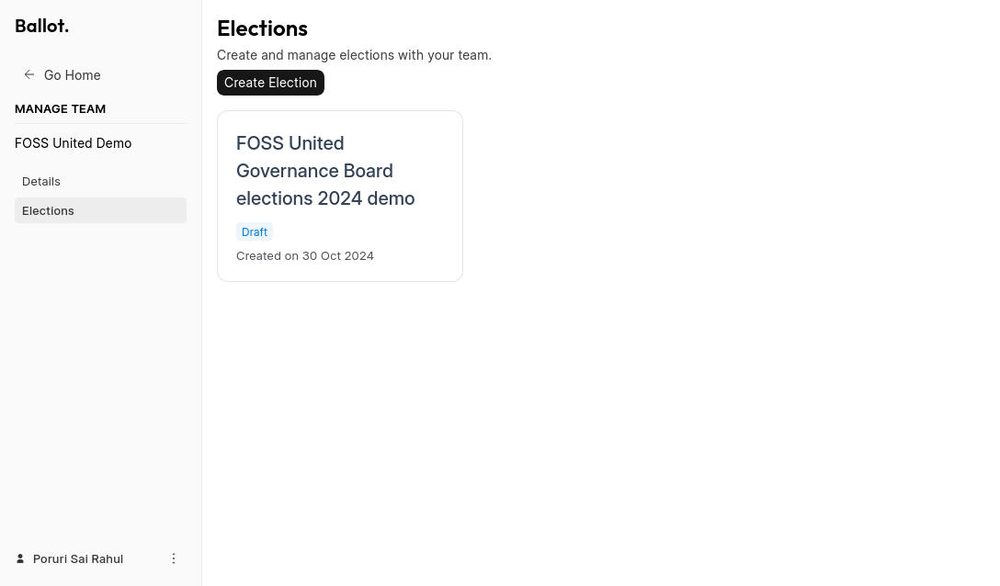|

* Once created, the Election should be displayed in the Elections page. By
  default, the Election isn't "live". To make it "live", please click on the
  Election and update the "Status" under "Details" to "Live", provide a 
  "Slug", and update the Description of the Election.

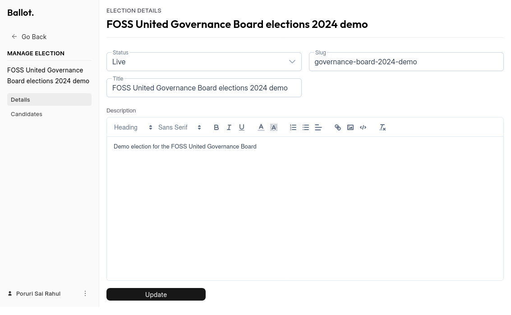

## Creating a Candidature Form

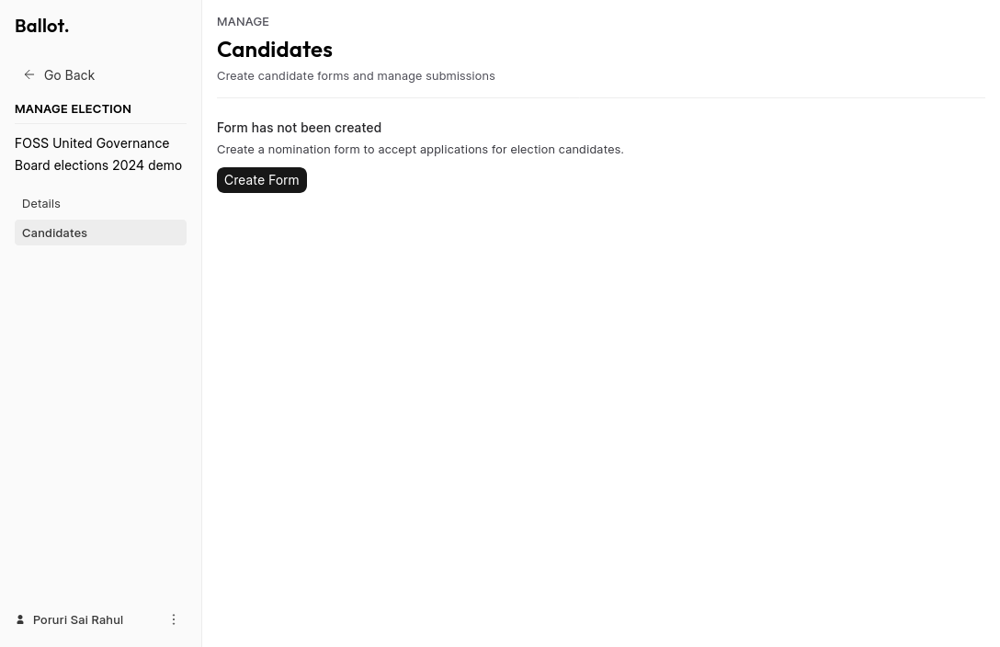

* Members of the Community who are interested in running for Election should
  submit a Candidature Form. The Candidature Form can be created by clicking
  on "Create Form" under the "Candidates" section of the Election

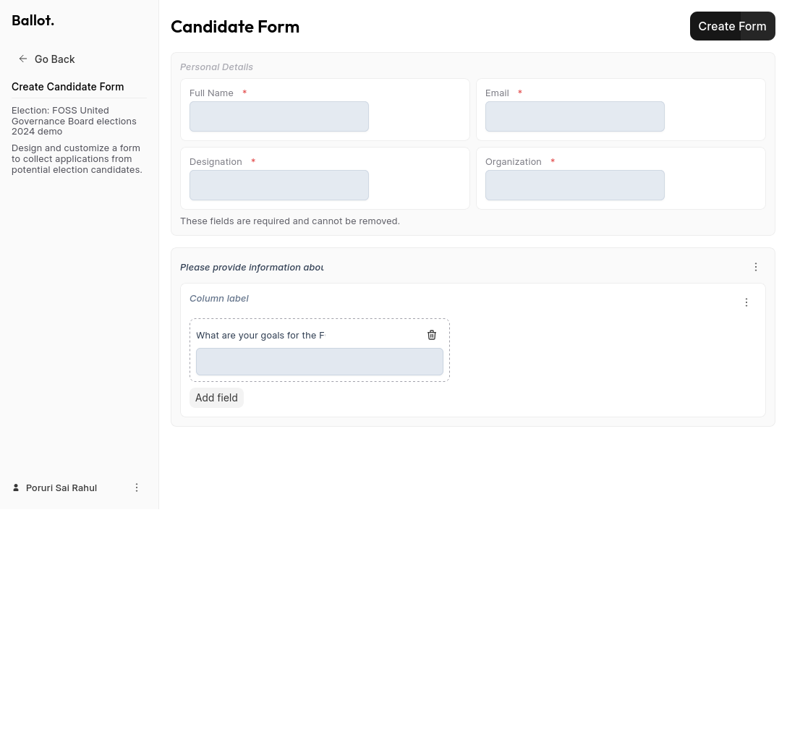

* The Candidate Form can be customized according to the needs of the Community
  e.g. the layout of the forum and the questions in the forum can be
  customized when creating the Candidature Form.

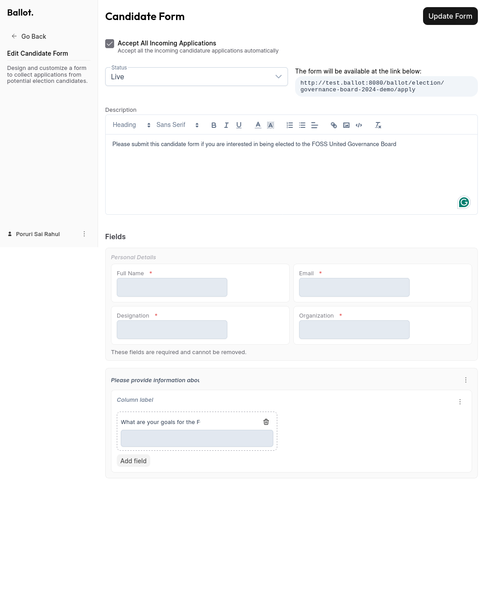

* The Candidature Form needs to made "Live" by clicking on "Update Form"
  and updating the Status to "Live". The "Description" for the Candidature
  Form can also be updated here

## Manage Candidates

* Once created, members of the Community can express their interest in running
  for Election by submitting information via the Candidature Form. Information
  about submissions can be viewed in the "Candidates" page for the Election.

|Candidates with no submissions|Candidates page with a submission|
|---|---|
|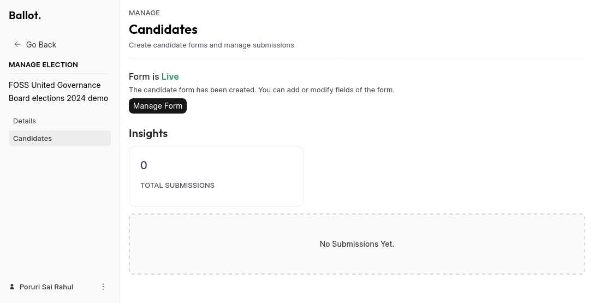|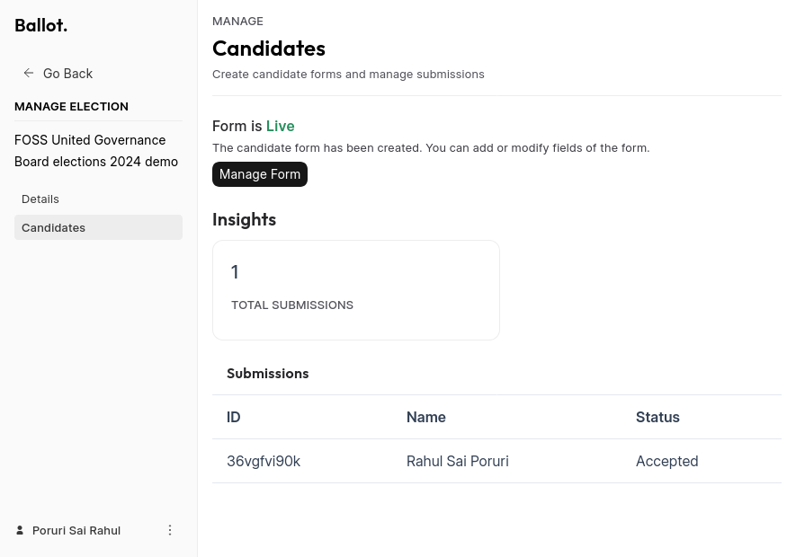|
